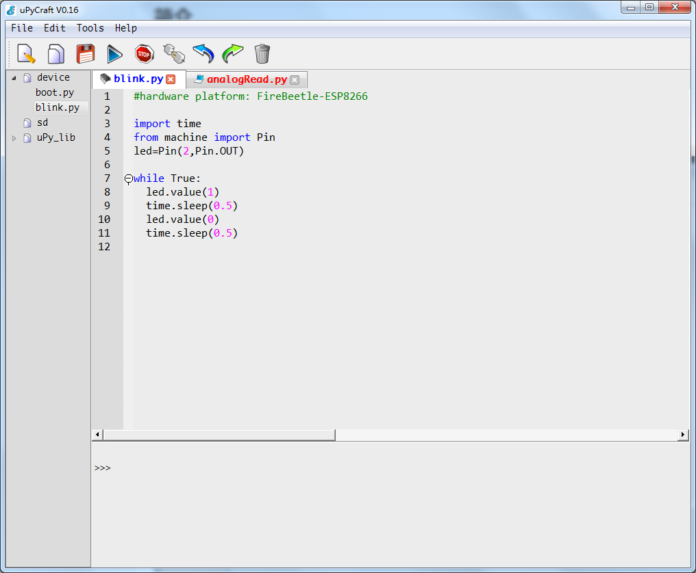

# Setting up things

## Preparing our ESP8266  {#preparing-our-esp8266}

For us to be able to do what we discussed above, there are certain software packages that are required in order to quickly get us started with the most fun part - MAKING!

### The uPyCraft IDE\(Integrated Development Environment\) {#the-upycraft-ide-integrated-development-environment}

The uPyCraft IDE is the official development software released by the MicroPython community to Edit, Verify and Upload our Application\(microPython program\) to the ESP's memory. It also integrates all the other required development tools that are necessary to design a great IoT gadget.

Click [here](https://github.com/DFRobot/uPyCraft/blob/master/uPyCraft_V0.30.exe) to download the latest version_&lt;8th Aug''2018&gt;_ for your Windows PC.

### Setting up the IDE {#setting-up-the-ide}

After installing the uPyCraft IDE, double-click on the desktop icon and launch the program and there you go! It is a user-friendly software that allows us to write and upload our Python scripts to the NodeMCU development board

After launching the program, we need to head towards the Menu bar and navigate to _Tools &gt; Serial &gt; COM&lt;n&gt;,_ where _COM&lt;n&gt;_ needs to be replaced with the assigned COM port to your NodeMCU.  
In order to check yours, go to My Computer -&gt; Properties -&gt; Device Manager -&gt; Ports\(COM & LPT\)


If nothing gets displayed in the Ports section, download this missing driver - [CH340](https://sparks.gogo.co.nz/assets/_site_/downloads/CH34x_Install_Windows_v3_4.zip)


After selecting the correct COM port, head on towards _Boards_ -&gt; _esp8266_ and now we are ready to talk with our IoT dev board. As can be seen from the screenshot above, the IDE is graphically arranged into three basic sections

* Code-editing area -&gt; upperRightHalf
* MicroPython REPL `>>>` prompt to quickly test small-chunks of code -&gt; lowerRightHalf
* Side-pane for MicropPython _file-system_


In general, a _file-system_ is used to store and organize data on a hard-disk, a flash-storage in our case.


Just like Windows and Mac, all the files in the MicroPython firmware are arranged in a tree-structure.

When the NodeMCU powers up, the _boot.py_ program runs initially followed by the _main.py_ file which contains our main code for whatever "thing" we want to make.

To check what file your NodeMCU possess, navigate to the side-pane of the IDE and click on the _Device_ icon

