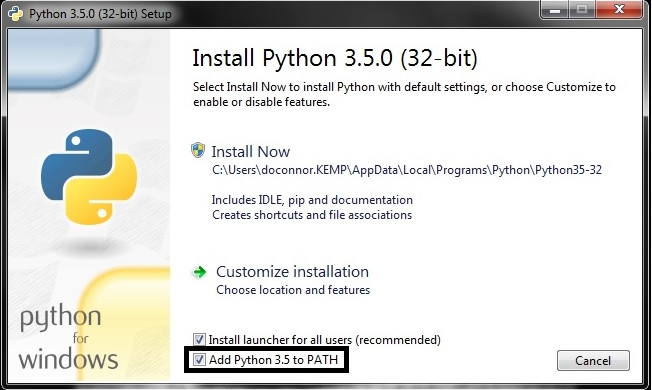
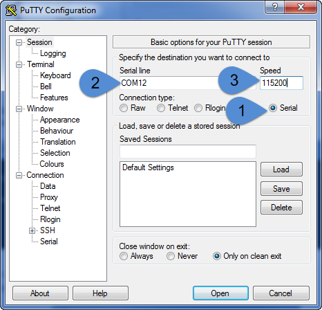

# Our Development Environment

## Getting familiar {#setting-up-our-environment}

### The IoT Development Board {#the-iot-development-board}

The NodeMCU development board has been the choice of more than 100's of thousands of IoT developers to test and prototype their devices. It mounts the World famous ESP8266 module that has an on-board high-range WiFi antenna to get us connected with the Internet and an embedded microprocessor running at 80 MHz\(160 MHz when over-clocked\) to do all the operations with enough memory\(4 MB\) for us to build any sort of IoT application. Most importantly, there are female mounting-headers to fix it on a breadboard to quickly get us started with our First IoT Gadget

~~&lt;illustration - NodeMCU dev board with _proper labeling_&gt;~~

~~&lt;illustration - NodeMCU mounted on a BB with available pins for connections&gt;~~

### A Firmware \(_just enough OS_\) {#firmware}

We have heard about Hardware and Software aspects of Computers, but a Firmware, what is it? Nothing to worry about here, it is not a new innovation or a recent noble discovery. In fact, it has always been around us hidden in almost every electronic device and appliance that we use in our daily lives. Just for the sake of understanding, let us consider this - Software/Applications is top floor of a 2-storied building named OS\(an Operating System like Windows/Mac /Linux\), then "firmware" can be considered as the 1st floor and the Hardware as the Ground floor of the entire Operating Environment.

Thus, we can say that a "firmware" is much closer to the hardware to control it, whereas Application/Software sit on top on these two guys to get it's work done. This is what actually happens, the "firmware" is a super-shrinked OS meant to deal with the specific hardware\(Microprocessor, ICs, Peripherals, Sensors, etc.\) components on the motherboard instead of running applications like a Web-browser or a game. Such high-end tasks are managed by the OS. The way a "firmware" deals with the system hardware circuitry depends entirely on what has been programmed into its memory. This type of memory in most cases is read-only, i.e., you cannot touch it to make any changes that you want, but there are plenty of development boards available with sufficient processing power and memory to run a "firmware" on top of it.

### MicroPython Firmware  {#the-micropython-firmware}

The MicroPython Firmware is a specially designed micro OS, written in the World-Wide famous programming language, Python, to make IoT development much faster and robust as MicroPython inherits all the powers of the Python with everything irrelevant removed from the core language. The firmware basically allows us access to the ESP module's great computational power, its stable WiFi Capability and gives us the liberty to choose any kind of Input and Output device to connect with our IoT device such as buttons, displays, keypads and a lot of sensors as well. This results in a whole new possibilities of Web-connected Gadgets and Devices which can serve us and make our lives much more convenient. Note here that, all of the above plus the WiFi capability of the ESP module gives us the ability to control and monitor our Gadgets from anywhere around the globe. That's pretty amazing!

## Preparing our ESP8266 

For us to to be able to all which we talked about above, there are certain software packages that we will require in order to quickly get started with the most fun part that we all love, MAKING!

### Installing Python

Firstly, install the latest release of Python - [Download](https://www.python.org/downloads/windows/) now!


Tick the check-box `Add Python to PATH` during the installation to get access of `python` and `pip` via command-line




### The esptool



```text
C:\any_directory> p
ip install esptool
```



```
C:\any_directory> p
ip install adafruit-ampy
```



After successful installation of the **esptool**, we are now capable of manipulating ESP's memory. 

At first, we will _format_ the flash memory of our ESP module by using the following command `esptool.py --port COM<n> erase_flash`         


Here, `<n>` indicates the COM port number assigned to your NodeMCU.  
See My Computers --&gt; Properties --&gt; Device Manager --&gt; Ports\(COM&LPT\) to find your specific port number.


You should see the following output on the command prompt

~~&lt;image&gt;~~

After performing a format on the flash drive, we now need to write the MicroPython firmware into ESP's memory. In technical terms, it is called _flashing_ onto a _flash-drive_. To download the latest firmware, click [here](http://micropython.org/download#esp8266).

Now, change your current working directory to the place where you downloaded the MicroPython binary by using the `cd` command in command prompt. For example, if your current working directory is `D:\some-folder>` and your downloaded firmware is in the _Downloads_ folder, do the following - 

`cd C:\Users\<user-name>\Downloads` , where `<user-name>` is your name on the PC.      
  
and then, enter the following  
  
`esptool.py --port COM<n> --baud 460800 write_flash -fm dio 0x00000 <nodemcu-firmware>.bin`

where, `<nodemcu-firmware>` is the latest MicroPython firmware that you just downloaded above and `COM<n>` represents your NodeMCU's com port.

### Setting up PUTTY

Now at last, we require a tool that can communicate with the NodeMCU over the USB cable. 

**Putty** has been the choice so far of the IoT community to talk with their devices over a serial port. Click [here](https://www.chiark.greenend.org.uk/~sgtatham/putty/latest.html), to download it right away and proceed with the installation.

After the installation of Putty is done, we need to create a profile within. Launch Putty and select the Serial dot-box to create a serial-connection profile and enter the following in the given fields:

**COM port** - See My Computer &gt; Properties &gt; Device Manager &gt; Ports\(COM and LPT\) for your specific port number. **Baud rate** - 115200. It is default speed in bits-per-second that our ESP module uses, in order to communicate with the PC.



Name this profile and save it to quickly load it the next time you use Putty. Finally, click on the "Open" button. A dialog-box with a black background will pop-up ; Press the `RESET` button on the NodeMCU dev board and watch that Window. You will see that the board has been successfully reset and the Python REPL prompt `>>>` is waiting for us to give instructions.

### ​ {#undefined}

