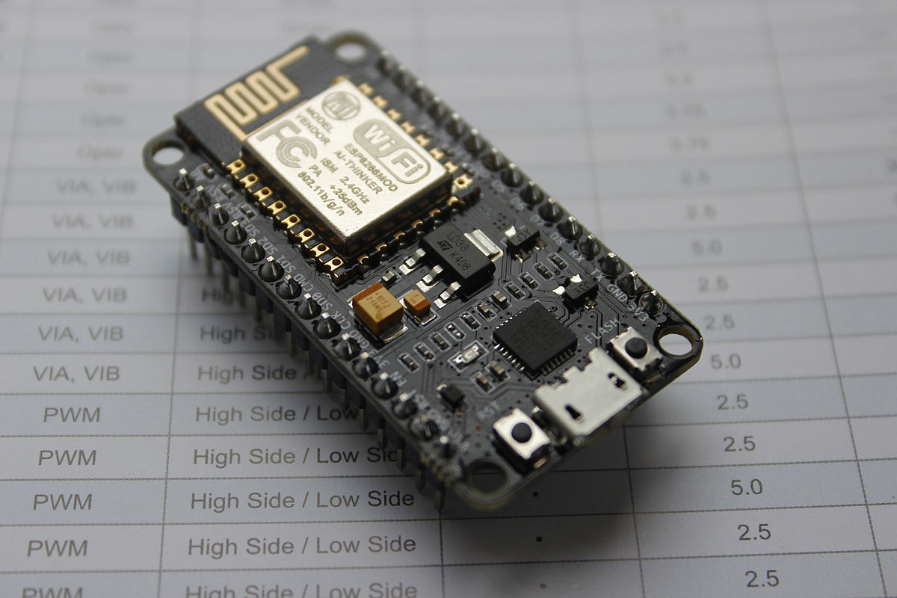
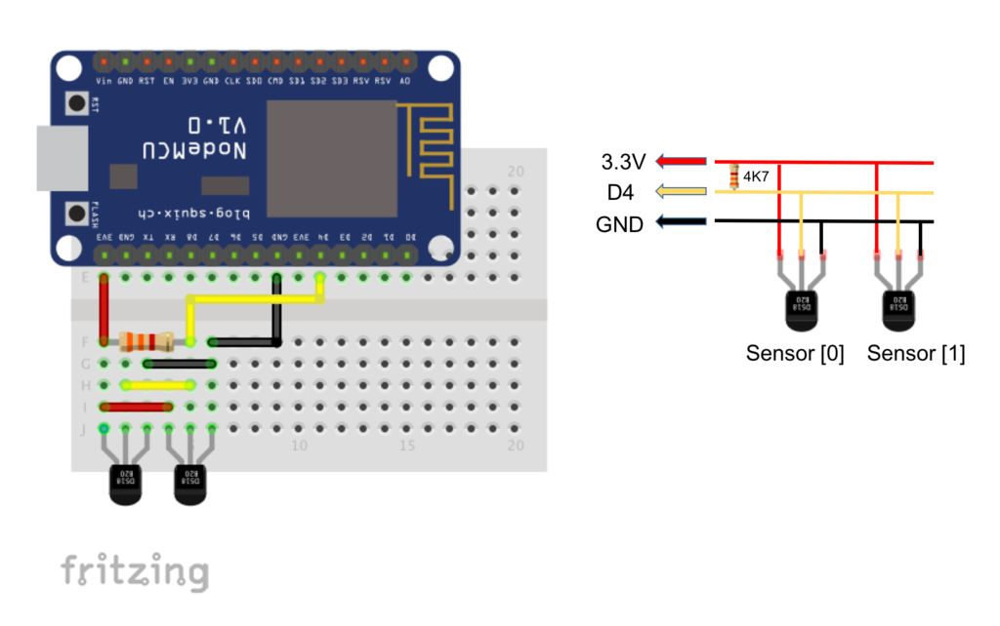

# Getting familiar

## The Development Board {#setting-up-our-environment}

### The NodeMCU {#the-iot-development-board}

The NodeMCU development board has been the choice of more than 100's of thousands of IoT developers to build their own IoT devices. It mounts the world-famous ESP8266 module that has an on-board WiFi antenna to get us connected with the Internet and a power micro-controller with sufficient RAM and Hard Disk to do all the operations. Thus, it has a perfect ecosystem for building any sort of minor to major IoT application.

The NodeMCU houses a Microcontroller, which is a computer in itself and contains everything that we will require in order to design intelligent, web-enabled gadgets.

Have a look at few of the major features of NodeMCU - 

* WiFi Module with an onboard antenna
* 80-160 MHz processing speed - More than enough for us to launch satellites
* Pins for connecting multiple sensors and actuators


All the blue-highlighted pins\(GPIOs\) in the above pinout-diagram are for connections with any type of electronic circuit, sensor or actuator like LED, Motor, Switch and a lot of other stuff.


### Network of Sensors

With the liberty to connect multiple devices, we can actually create a **local** network of sensors on the NodeMCU which piles up the sensor values onto its 4 MB memory and send this gathered data to a freely-available cloud-service. 

. . . 

As we saw above that NodeMCU has the freedom to extend itself by connecting various different devices, but it lacks the computation to run a full-fledged OS like Windows or Mac. In our case this should be considered as an advantage because the fact is - We don't need an OS to make an IoT gadget. What we need is a _just-enough_ Operating System, small enough to fit inside a 4 MB flash-storage.

### Firmware - A _just-enough_ OS {#firmware}

We have heard about Hardware and Software aspects of a Computer, but a Firmware, what is it? Nothing to worry about, it is not a new innovation or a recent noble discovery. In fact, it has always been around us hidden in almost every electronic device and appliance that we use in our daily lives. Just for the sake of understanding, let us consider this - Software/Applications is top floor of a 2-storied building named OS\(an Operating System like Windows/Mac /Linux\), then "firmware" can be considered as the 1st floor and the Hardware as the Ground floor of the entire Operating System building.

Thus, we can say that a "firmware" is much closer to the hardware to control it, whereas Application/Software sit on top on these two guys to get their work done. This is what actually happens! The "firmware" is a super-shrinked OS meant to deal with the specific hardware\(Microprocessor, ICs, Peripherals, Sensors, etc.\) components on the motherboard instead of running applications like a Web-browser or a game. Such high-end tasks are managed by the OS. The way a "firmware" deals with the system hardware depends entirely on what has been programmed into its memory. This type of memory in most cases is read-only, i.e., you cannot touch it to make any changes that you want, but there are plenty of development boards available with sufficient processing power and memory to run a "firmware" on top of it.

### The MicroPython firmware  {#the-micropython-firmware}

The MicroPython Firmware is a specially designed micro OS, written in the World-Wide famous programming language, Python, to make IoT development much faster and robust as MicroPython inherits all the powers of the Python with everything irrelevant removed from the core language. The firmware basically allows us access to the ESP module's great computational power, its stable WiFi Capability and gives us the liberty to choose any kind of Input or Output device to connect with our IoT device such as buttons, displays, keypads and a lot of sensors as well. 

This results in a whole new possibilities of web-connected Gadgets and Devices which can serve us and make our lives much more convenient. Moreover, all of the above plus the WiFi capability of the ESP module gives us the ability to _control_ and _monitor_ almost anything, from anywhere around the globe plus a sense of satisfaction and convenience it brings along, is something invaluable.

